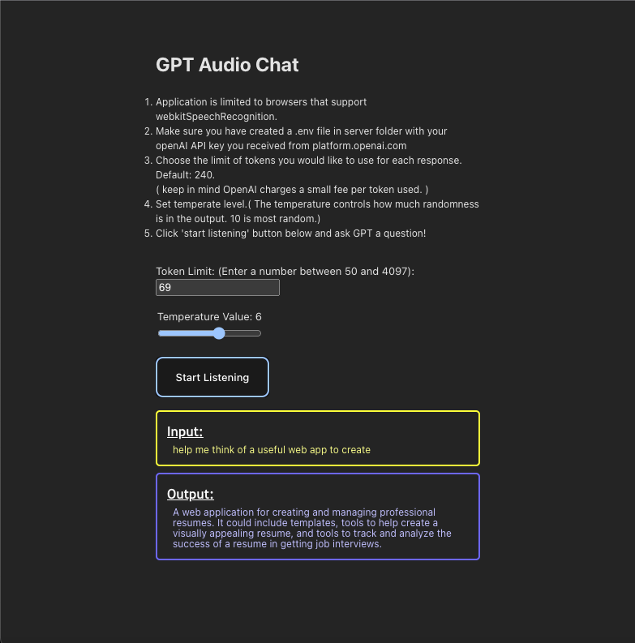

# gpt3.5AudioConverter

[](https://github.com/PublicRouter/gpt3.5AudioConverter)
[](https://github.com/your-username/gpt3.5AudioConverter/commits/main)

...


gpt3.5AudioConverter is an interactive web application that facilitates seamless interaction with OpenAI's chatCompletion and normal completion models. The app offers a user-friendly interface allowing users to effortlessly switch between davinci-003 and gpt3.5 models. It empowers users to customize the token limit for each response using an input field and set the prompt temperature level with an intuitive sliding bar.



## Features

- Choose between davinci-003 and gpt3.5 models for chatCompletion and normal completion.
- Customize token limit for responses using an input field.
- Adjust prompt temperature level using a sliding bar.
- Utilize webkitSpeechRecognition for browser audio interpretation.
- Convert voice input into text for processing by the chosen model.
- Receive optimal responses and display them as text on the screen.
- Utilize speechSynthesis to read the response aloud, facilitating fluid conversations with the model.
- Choice between normal completion API and chatCompletion API interfaces.
- In chatCompletion mode, maintain conversation history for ongoing context.

## Installation

1. Clone the repository: `git clone https://github.com/PublicRouter/gpt3.5AudioConverter.git`
2. Navigate to the project directory: `cd gpt3.5AudioConverter`
2. Open two integrated terminals and navigate to the respective sub-directories: <br />1. `cd audioChatWithGPT` (front-end) <br/> 2. `cd server` (server)
3. At root of `server` directory create .env file with two variables: <br/>

    ```
    OPENAI_API_KEY="[enter api key here]" 
    OPENAI_ORG="[enter org string here]"
    ```
    `NOTICE: You must have a openai API key and payment plan setup to pay for api usage when sending prompts to openai.` <br/>
    <br />
    `For reference on 8/17/23 I was charged $0.027 USD for use of 2554 tokens. Price per token does fluctuate based on total user traffic at a given time.`


3. Install dependencies in both sub-directories via terminal: `npm install`
4. Start development environments in both sub-directories: 
    1. audioChatWithGPT - `npm run dev`
    2. server - `npm run start`
5. Navigate in browser to localhost url: `http://127.0.0.1:5173/`

## How to Use

1. Launch the gpt3.5AudioConverter application.
2. Select the desired model: davinci-003 or gpt3.5.
3. Set the token limit for responses using the input field.
4. Adjust the prompt temperature level using the sliding bar.
5. Press the "Start Listening" button to activate webkitSpeechRecognition.
6. Speak your questions into the computer microphone.
7. The app converts your voice input into text and sends it to the selected OpenAI model.
8. Receive an optimal response displayed as text on the screen.
9. Listen to the response as the app reads it aloud using speechSynthesis.
10. Switch between normal completion and chatCompletion interfaces based on your conversation needs.
11. In chatCompletion mode, enjoy persistent conversation history for contextual conversations.

## Technologies Used

- Vite: Front-end framework
- React: For building front-end components.
- WebkitSpeechRecognition: For browser audio interpretation.
- Express.js: Server for storing each instance chat state, handling api keys, and querying OpenAI.
- OpenAI API: For interacting with the chatCompletion and normal completion models.
- SpeechSynthesis: Converting text responses to audio.

## Contributions

Contributions are welcome! If you find any issues or have suggestions for improvements, feel free to create a pull request or open an issue in the GitHub repository.

## License

This project is licensed under the MIT License - see the [LICENSE](LICENSE) file for details.
